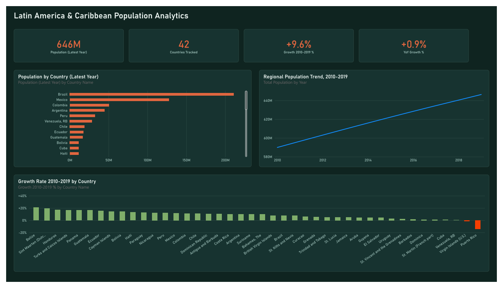

# 📊 Latin America & Caribbean Demographic Dynamics (2010 – 2019)

*One of my first data projects (May 2026).*

Population analysis pipeline built with **R** and the **Tidyverse**, turning a raw World Bank WDI spreadsheet (`data/population_latin_america.xlsx`, `Data` sheet) into a Power BI dashboard covering scale, growth, and decline across the region.

## 🔧 How to Use
```
Rscript analysis.R
```
Runs the load → tidy pipeline over the source spreadsheet. (`generate_missing_plots.py` is a pandas fallback for environments without R.)

## 📈 Key Insights
- By 2019 the tracked region reached **646.4M** people; Brazil (211.1M) and Mexico (127.6M) alone account for more than half of it.
- Smaller nations grew fastest in relative terms — **Belize** led the decade at ~21% growth.
- **Puerto Rico** and **Venezuela** are the clearest outliers, both with sharp population declines.

## 🖥️ The Dashboard

`latin_america_population_data.pbip` (open with Power BI Desktop — File →
Open → the `.pbip` file; it pulls straight from
`data/population_latin_america.xlsx`). Dark teal/terracotta theme,
Bahnschrift throughout, one page.



A static export (`latin_america_population_data.png`) lives alongside the
`.pbip` for anyone without Power BI Desktop.

**KPI strip:** Countries Tracked, Population (Latest), YoY Growth, and
Growth (2010–2019) — each raw count paired with a rate so the headline
figure always has comparative context. Below that: a regional population
trend line, population by country, and growth by country.

## 📂 Structure
```
data/population_latin_america.xlsx   raw WDI source
analysis.R                            full pipeline: load → tidy
latin_america_population_data.pbip   Power BI project (open in Desktop)
latin_america_population_data.Report/       PBIR: pages, visuals as JSON
latin_america_population_data.SemanticModel/ TMDL: tables, measures
latin_america_population_data.png    static export of the dashboard
```
