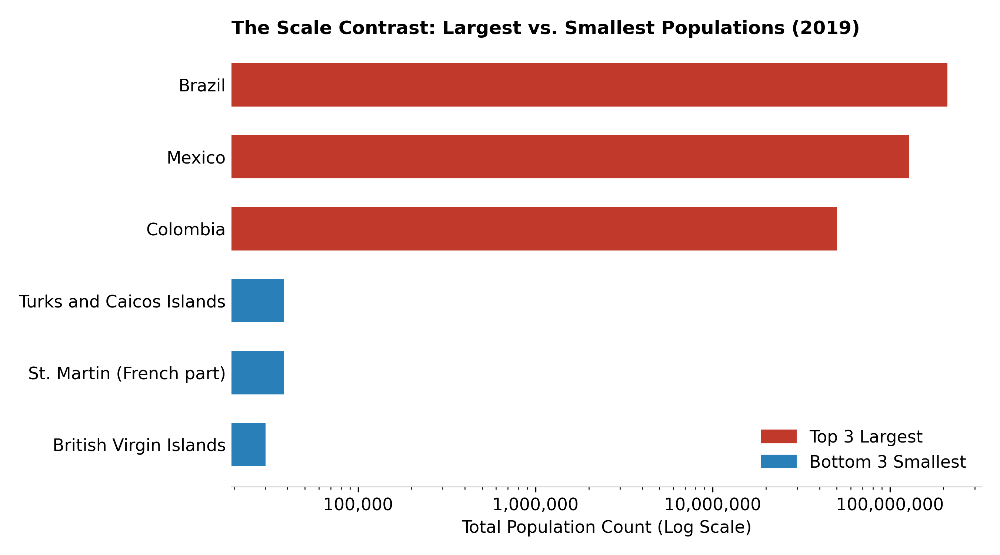
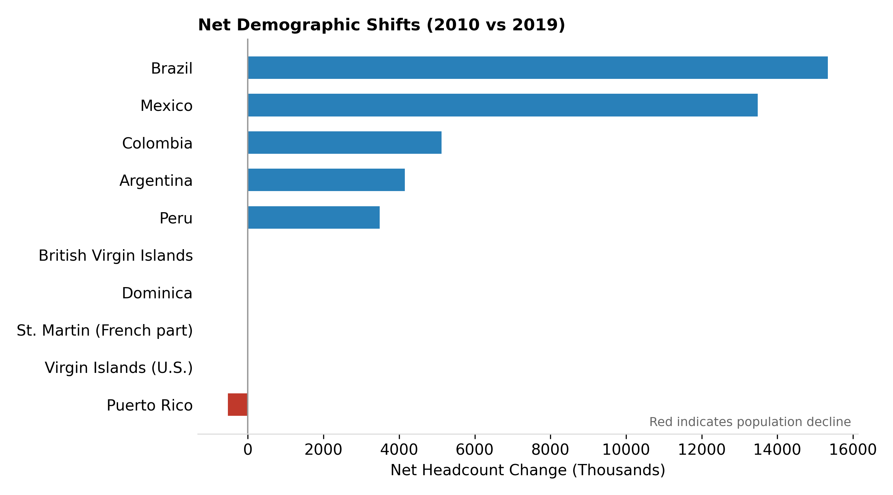

# 📊 Latin America & Caribbean Demographic Dynamics (2010 – 2019)

Population analysis pipeline built with **R** and the **Tidyverse**, turning a raw World Bank WDI spreadsheet (`data/population_latin_america.xlsx`, `Data` sheet) into seven charts covering scale, growth, and decline across the region.

## 🔧 How to Use
```
Rscript analysis.R
```
Regenerates every chart in `plots/` from the source spreadsheet. (`generate_missing_plots.py` is a pandas/matplotlib fallback for the two log-scale/net-change charts, for environments without R.)

## 📈 Key Insights
- By 2019 the tracked region reached **646.4M** people; Brazil (211.1M) and Mexico (127.6M) alone account for more than half of it.
- Smaller nations grew fastest in relative terms — **Belize** led the decade at ~21% growth.
- **Puerto Rico** and **Venezuela** are the clearest outliers, both with sharp population declines.

## 📊 Charts

**Top 5 Most Populous Countries (2019)**


**Population Growth Trajectories, 2010–2019**


**Top 5 Fastest-Growing Populations (%)**


**Largest vs. Smallest Populations (log scale)**


**Nations Under 5 Million (2019)**


**Net Demographic Shifts, 2010 vs. 2019**


**Year-over-Year Growth Velocity Heatmap**


## 📂 Structure
```
data/population_latin_america.xlsx   raw WDI source
plots/                                generated charts
analysis.R                            full pipeline: load → tidy → plot
```
